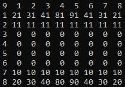

# Simple-Chess-Game
A personal project started in order to get a better grasp on the basics of C/C++ procedural programming. The scope of the project is the development of a chess game that is played in the console. The game will have a player versus player mode as well a player versus AI mode.

The board:  
  
It is represented as a 9x9 two-dimensional matrix with row 1 and column 1 being the row/column count. Right now the player interacts with the program by enetring coordinates on the board.  
The codes:  
-0 represents empty squares where pieces can move to.  
-Numbers ending with 0 are the white pieces.  
-Numbers ending in 1 are the black pieces.  
-1_ is the pawn.  
-2_ is the rook.  
-3_ is the knight.  
-4_ is the bishop.  
-8_ is the queen.  
-9_ is the king.  

Implemented features:  
-The player can move the white pieces.   
-That's it

Known Bugs:  
-Heap coruption when freeing the memory of the "moves" array.  

 
